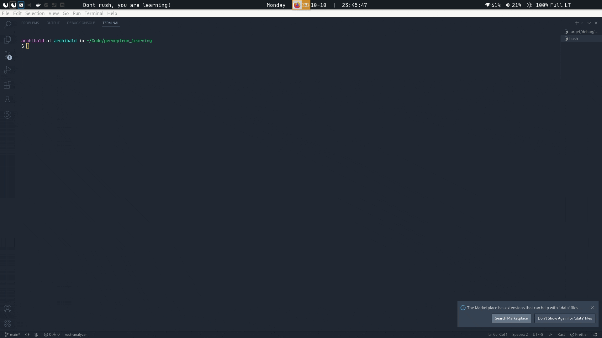

# Perceptron Learning
| Table Of Contents        | link        |
| -------------------------| ----------- |
| About 🔍                  |  [here](#1) |
| Running and Debuging 🛠️   |  [here](#2) |

## About 🔍 
Neuron training program built with Rust, utilizes adeline (gradient descent) algorithm for wheight optimization

## Running and Debuging 🛠️ 
| Script            | Description     |
| ----------------- | --------------- |
| `cargo build`     | Compile package |
| `cargo run`       | Run package     |
| `cargo add crate` | Add crate (dep) |

